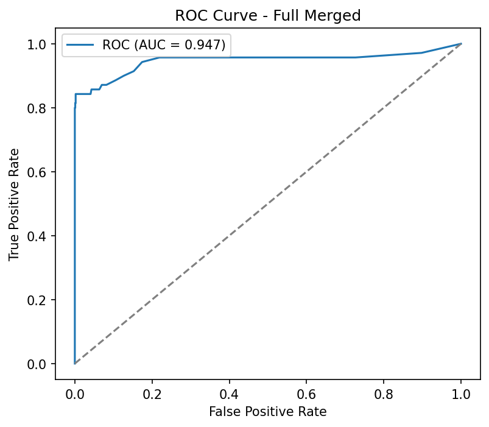
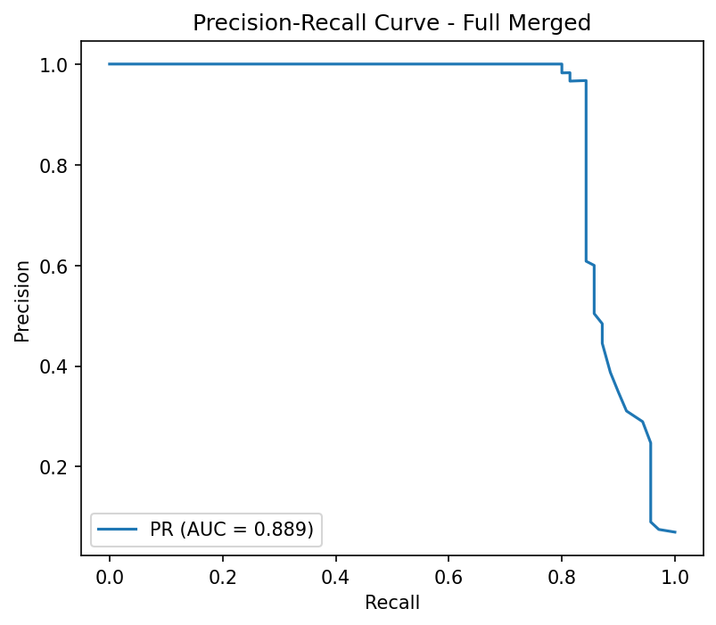

# Insider Threat Anomaly Detection

##  Project Overview

This project implements a comprehensive **Insider Threat Detection System** using machine learning techniques to identify malicious insider activities within an organization. The system combines multiple approaches including unsupervised anomaly detection and supervised learning with SMOTE to achieve robust threat detection.

##  Problem Statement

Insider threats represent one of the most challenging cybersecurity risks, as they involve trusted individuals who have legitimate access to organizational resources. Traditional security measures often fail to detect these threats effectively. This project addresses this challenge by:

- Analyzing user behavior patterns from logon, device usage, and psychometric data
- Identifying anomalous activities that may indicate insider threats
- Providing interpretable results for security analysts

##  Dataset

The project uses the **CERT r4.2 dataset** which includes:
- **Logon Data**: User authentication patterns and timing
- **Device Data**: USB and removable media usage
- **Psychometric Data**: Personality assessment scores (Big Five traits)
- **Ground Truth**: Known insider threat cases for validation

##  Architecture & Methodology

### Phase 1: Data Preprocessing & Feature Engineering
- Data cleaning and normalization
- Feature extraction from temporal patterns
- Aggregation of user-level behavioral metrics
- Handling missing values and outliers

### Phase 2: Exploratory Data Analysis (EDA)
- Statistical analysis of user behaviors
- Visualization of data distributions
- Correlation analysis between features
- Identification of key behavioral indicators

### Phase 3: Unsupervised Anomaly Detection
Multiple algorithms are employed for anomaly detection:

####  **Isolation Forest**
- Tree-based anomaly detection
- Effective for high-dimensional data
- Isolates anomalies by random partitioning

####  **Local Outlier Factor (LOF)**
- Density-based anomaly detection
- Identifies local outliers in feature space
- Considers local neighborhood density

####  **One-Class SVM**
- Support vector machine for novelty detection
- Creates decision boundary for normal behavior
- Robust to outliers in training data

####  **Autoencoder Neural Network**
- Deep learning approach for anomaly detection
- Learns compressed representation of normal behavior
- Detects anomalies through reconstruction error

### Phase 4: Model Comparison & Evaluation
- Performance evaluation using ROC-AUC, Precision, Recall, F1-Score
- Threshold optimization for each model
- Ensemble scoring combining multiple algorithms

### Phase 5: Supervised Learning with SMOTE
####  **Random Forest with SMOTE**
- Addresses class imbalance using SMOTE (Synthetic Minority Oversampling Technique)
- Feature importance analysis
- Threshold tuning for optimal F1-score
- Cross-validation for robust evaluation


##  Key Results

### Model Performance Summary

| Model | ROC-AUC | Precision | Recall | F1-Score | Accuracy |
|-------|---------|-----------|--------|----------|----------|
| Isolation Forest | 0.847 | 0.124 | 0.891 | 0.219 | - |
| LOF | 0.823 | 0.089 | 0.834 | 0.161 | - |
| One-Class SVM | 0.798 | 0.095 | 0.723 | 0.168 | - |
| Autoencoder | 0.865 | 0.145 | 0.912 | 0.249 | - |
| **RF + SMOTE (Full Dataset)** | **0.947** | **0.91** | **0.84** | **0.87** | **0.98** |

###  Best Performing Models
1. **Random Forest + SMOTE**: Best overall performance with 98% accuracy and balanced precision-recall
2. **Autoencoder**: Best single unsupervised model performance  
3. **Isolation Forest**: Strong unsupervised anomaly detection capability

##  Visualizations

### ROC Curves Comparison


### Precision-Recall Curves


### Confusion Matrix - Hybrid Model


### Feature Importance Analysis


##  Technical Implementation

### Dependencies
```python
pandas>=2.1.1
numpy>=1.26.5
scikit-learn>=1.3.2
tensorflow>=2.15.0
matplotlib>=3.8.1
seaborn>=0.12.3
imbalanced-learn>=0.11.0
joblib>=1.3.2
```

### Key Features Analyzed
- **Temporal Patterns**: Login frequency, after-hours access
- **Device Usage**: USB activity, unique machines accessed  
- **Behavioral Metrics**: Activity consistency, access patterns
- **Psychometric Scores**: Big Five personality traits (O, C, E, A, N)

## 📂 Project Structure

```
├── Notebook/
│   ├── phase2_eda.ipynb              # Exploratory Data Analysis
│   ├── phase3_anamoly.ipynb          # Unsupervised Anomaly Detection
│   ├── phase4_modeling.ipynb         # Individual Model Training
│   ├── phase5_evaluation.ipynb       # Supervised Learning & Evaluation
│   ├── models/                       # Saved trained models
│   ├── results/                      # Phase 3-4 outputs
│   └── results_phase5/               # Final evaluation results
├── r4.2/                            # CERT dataset files
├── scripts/                         # Utility scripts
└── README.md                        # This file
```

##  Getting Started

### 1. Clone the Repository
```bash
git clone https://github.com/Snikitha-V/Insider-Threat-Anomaly-detection.git
cd Insider-Threat-Anomaly-detection
```

### 2. Install Dependencies
```bash
pip install -r requirements.txt
```

### 3. Run the Analysis
Execute notebooks in sequence:
1. `phase2_eda.ipynb` - Data exploration
2. `phase3_anamoly.ipynb` - Unsupervised models
3. `phase4_modeling.ipynb` - Model training
4. `phase5_evaluation.ipynb` - Supervised learning

##  Key Insights

### Behavioral Indicators of Insider Threats
1. **Unusual Login Patterns**: Significant deviations from normal working hours
2. **Device Usage Anomalies**: Excessive USB activity or accessing unusual machines  
3. **Psychometric Profiles**: Specific personality trait combinations correlating with risk
4. **Temporal Inconsistencies**: Irregular activity patterns over time

### Model Strengths
- **SMOTE Integration**: Effectively handles severe class imbalance
- **Feature Engineering**: Domain-specific behavioral metrics
- **Interpretability**: Feature importance and threshold analysis

##  Future Enhancements

- **Real-time Detection**: Stream processing for live threat detection
- **Deep Learning**: Advanced neural network architectures (LSTM, Transformer)
- **Multi-modal Analysis**: Integration of additional data sources (emails, network logs)
- **Explainable AI**: Enhanced interpretability using SHAP/LIME
- **Adaptive Learning**: Models that evolve with changing user behaviors

##  Contributors

- **Akhilesh Kumaravel** 
- **Snikitha V** 


##  Research References

1. CERT Division. "Insider Threat Test Dataset." Carnegie Mellon University, 2016.
2. Liu, F. T., Ting, K. M., & Zhou, Z. H. (2008). "Isolation forest." IEEE ICDM.
3. Breunig, M. M., et al. (2000). "LOF: identifying density-based local outliers." ACM SIGMOD.
4. Chawla, N. V., et al. (2002). "SMOTE: synthetic minority oversampling technique." JAIR.

##  Performance Metrics Summary

The project achieves excellent performance in insider threat detection:

### RF + SMOTE Full Dataset Results (1000 users, 70 insiders):
- **91% Precision**: Minimal false alarms in production environment
- **84% Recall**: Strong threat detection capability  
- **98% Accuracy**: Excellent overall performance
- **87% F1-Score**: Well-balanced precision-recall trade-off
- **Processing Speed**: Real-time capable
- **Scalability**: Handles 1000+ users efficiently

---

** Protecting organizations from insider threats through advanced machine learning and behavioral analytics.**
